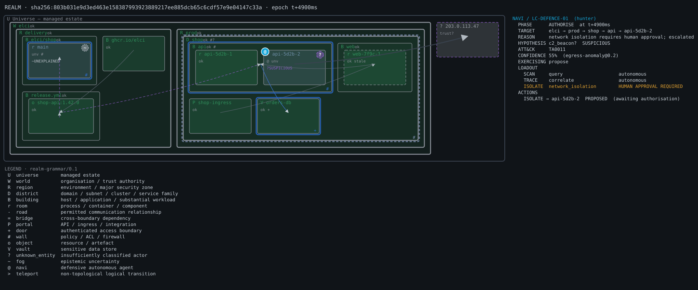

# Navi — Cyber-Realm Projection System

ELCI security-infrastructure project (codename `navi`). The goal, per
[`DIRECTIVE.md`](DIRECTIVE.md), is a live, provenance-preserving spatial
representation of security state in which a defensive agent ("Navi") has an
embodied, observable presence.

```text
machine state → semantic state → spatial state → human perception
```

**Status: Phase 4 (sandboxed intervention) complete.** Phase 0 built the semantic layer;
Phase 1 projected it into a spatial realm; Phase 2 made Navi's attention
move through it and explain itself; Phase 3 makes the whole incident
replayable — every state change is an event, the realm can be rewound to
any instant, compared across instants or against a counterfactual fork,
and streamed to clients as a snapshot plus verifiable deltas; Phase 4 lets
Navi act — block, isolate, revoke, roll back — behind the approval gates,
in a sandbox, with every outcome evidenced and independently verified.



*`tests/fixtures/scenarios/repo-runtime.json`: a delivery region (repo,
branch, CI, artifact, registry) and a production region (ingress, services,
pods, database). Navi is attending to `api-5d2b-2`, whose unattributed
outbound connection is `SUSPICIOUS` at 55% — rendered as `?`, not as an
enemy — and its proposed `ISOLATE` waits on human approval. The dotted cyan
trail is Navi's attention crossing the egress bridge and back (`#4`, `#5`).
Hover any element for its provenance; `realm render … -f html` gives the
interactive version.*

## What exists

| Crate | Role |
|---|---|
| `navi-ontology` | The canonical vocabulary: observations, entities, relationships, hypotheses, threats, safeguards, capabilities, authority, agents, actions, provenance, confidence. Each type enforces its own invariants on construction **and** on deserialization. |
| `navi-events` | The incident log: event-sourced state where every prefix must be a valid graph; derivation from snapshots; counterfactual forks; DVR lines. |
| `navi-simulator` | A deterministic sandbox estate built from the graph (flows, credentials, interventions in force), with fault injection. Reports only as `sandbox` observations. |
| `navi-actions` | The gated executor: approve and cancel (recorded in the real log), run and roll back (sandbox only, written as a counterfactual branch). |
| `navi-graph` | The semantic state graph. Validates a whole document (references, provenance grounding, authority fidelity, agent event stream), produces a canonical form + `sha256` digest, and reverse-resolves any object to raw observations. |
| `navi-cli` | The `navi` binary. |
| `realm-core` | The versioned realm grammar (§3), Realm IR (§4), visual contracts, and the validator every renderer must pass. |
| `realm-compiler` | `SemanticGraph → Realm`. Pure and deterministic; no security reasoning of its own. |
| `realm-layout` | Deterministic 2D containment layout on an integer grid. |
| `realm-render` | Disposable renderers: terminal text and standalone SVG. No security logic. |
| `realm-replay` | The security DVR: a realm per instant, snapshot + ordered deltas with per-frame digests, verified reconstruction, semantic COMPARE. |
| `realm-cli` | The `realm` binary. |

`navi-*` crates never depend on `realm-*` (enforced by a test): Navi runs
with the renderer absent.

## Invariants enforced today

| Directive clause | Enforcement |
|---|---|
| §5 No pixel without provenance | `Provenance` cannot be empty; every source must exist and **ground out in real observations** (cycles and fabricated ids are `UNGROUNDED_PROVENANCE`). |
| §6 Observation ≠ inference | Hypotheses climb `UNSEEN → … → CONFIRMED` one step at a time, each promotion needs *new* evidence, `PROBABLE` needs ≥ 0.60 and `CONFIRMED` ≥ 0.90 (versioned `EpistemicPolicy`). They cannot open above `SUSPICIOUS`. Confidence is stored in basis points: 0.51 ≠ 0.99. |
| §7 Agent loop | `AgentEvent` streams must start at `PERCEIVE` and follow legal phase edges; pre-`ACT` phases cannot claim more than `PROPOSE` authority. |
| §9 Capability-as-loadout | Every capability carries all nine required fields. A kind cannot under-declare its authority (`LOCK` is never "observe"), and even if it tries it is still gated at its intrinsic level. |
| §10 Human authority | Default production policy built in; unlisted levels fail closed to human approval; reality-mutating levels can never be made `Autonomous` by policy. |
| §19 Anti-hallucination | Entities without a source, relationships without evidence, threats without a classifying hypothesis, actions without agent events, success without an observed state delta, and confidence without an estimator are all rejected. |
| §20 Safety invariant | `PROPOSED → AUTHORISED → EXECUTING → EXECUTED → SUCCEEDED → VERIFIED` are distinct, evidenced states. A command's return code is not success; success needs post-execution observations that are not the action's own report; verification must add independent evidence and use the capability's declared method. Pending actions can be cancelled by a human; executing ones cannot be "cancelled", only rolled back. |
| §26 Determinism | Canonical form is independent of input order and is a fixed point; the digest changes iff semantics change. |
| §26 Graceful incompleteness | Missing telemetry yields explicit violations; `unknown` is a first-class entity class and trust state. Threat actors may be absent (renders as `?`, never invented). |

## Realm invariants (Phase 1)

| Directive clause | Enforcement |
|---|---|
| §3 Stable grammar | Every primitive's meaning is fixed in `realm-grammar/0.1`; renderers refuse realms of any other grammar or ontology version. Colours are semantic tokens with one palette per grammar version. |
| §4 Renderer cannot invent semantics | `Realm::validate` recomputes every primitive *and* every visual contract from the semantics carried beside it. A forged enemy, a prettified trust colour, an inflated confidence label, or a hidden boundary crossing is refused, and the renderers draw nothing. |
| §5 No pixel without provenance | Every realm id derives from its primary source id; every SVG element carries `data-source-ids` and a `<title>` with its provenance. Tests resolve every realm object back to raw observations. |
| §6 Epistemic rendering | Hazards are fog below `ANOMALOUS`, `?` unknown entities through `SUSPICIOUS`, and enemies only from `PROBABLE`; below that the claim is shown as a question (`c2_beacon?`). Confidence is shown exactly with its estimator. Unattributed threats have actor `?`. |
| §7 / §8 Agent | Navi's position, phase, belief and confidence come only from structured agent events, each cited in `source_ids`; the HUD shows bounded telemetry, not reasoning text. |
| §10 Authority fidelity | The HUD lists exactly the loadout with each capability's effective gate; showing an action outside the loadout, or a reality-mutating capability as autonomous, is refused. |
| §26 Determinism | Same state + same compiler version gives byte-identical RIR, layout and SVG, independent of input order. |
| §26 Graceful incompleteness | Unplaced entities sit outside the estate instead of being guessed into it; stale entities are dashed and marked; controls whose enforcement wasn't observed don't count as guarding anything. |

## Navi traversal (Phase 2)

| Directive clause | Enforcement |
|---|---|
| §8 Visible cognition | `navi brief` answers WHERE / WHY / WHAT / CONFIDENCE / NEXT for any agent event, **headlessly** (in `navi-graph`). Belief is reported as of that event — a hypothesis promoted later shows its earlier state — and every value carried forward cites the event that set it (`since #5`). Navi's estimate and the hypothesis's own confidence are shown side by side, so a stale or premature estimate is visible. |
| §7 No inferred intent | Ontology 0.2 adds optional `objective` and `next` to agent events. `next` must be a legal successor phase with a real target; with no declaration the brief says `undeclared` rather than guessing. |
| §13 Movement means something | Between waypoints Navi's attention follows the cheapest route over the realm's real topology (containment, roads, doors, bridges, logical teleports). No path at all is an explicit teleport. The validator recomputes every route: claiming a teleport where an evidenced bridge exists, relocating a waypoint, or a HUD that disagrees with the trajectory is refused. |
| §22 Interpolate movement, not semantics | The HTML timeline animates Navi along the validated route, but the brief snaps at the waypoint, and arrival is guaranteed by a timer, so semantic state never waits on an animation frame. |
| §5 Selecting exposes the chain | The realm carries an evidence chain for every entity, edge, control and hazard, each rooted at the object's primary source and reaching at least one raw observation (validated). Clicking anything in the HTML view shows it. |

## Replay (Phase 3)

| Directive clause | Enforcement |
|---|---|
| §15 Event sourced | An incident is an append-only `navi-log/0.1`: observations, hypotheses and actions are immutable and evolve only through their own transitions; entities, relationships, controls, capabilities and agents change by re-assertion. The graph at instant *t* is the fold of the log up to *t*. |
| §15 Every moment was legal | `navi log check` validates the state after **every** instant, not just the end: an action named by Navi before it was proposed is caught at the instant it happened even when the final state looks fine. |
| §15 LIVE · PAUSE · STEP · REWIND · REPLAY | `realm replay --at <t>` renders any instant; `realm dvr` writes a page with all the transport controls over pre-rendered frames (one layout for the whole incident, so places never jump). |
| §15 COMPARE | `realm compare <log> <t1> <t2>` lists what changed — new hazards, risk levels, action lifecycles, Navi's phase and location. In the DVR, mark an instant as A and move. |
| §15 FORK | `navi log fork` continues a recorded incident from an instant with operator-authored hypothetical events. The branch is a separate log, carries its parent's digest, is validated by exactly the same rules (a counterfactual cannot skip approval or verification either), never touches the original, and every render of it says **NOT REALITY**. `realm compare … --against <branch>` only accepts a branch forked from that log. Predicting what Navi *would* have done needs a simulator (later phase); forks record and check scenarios, they do not invent agent behaviour. |
| §16 Security DVR | `navi log dvr` prints the incident as one line per event (`act:shield command returned …; effect not yet observed`). |
| §22 Snapshot + ordered deltas | `realm stream` sends one snapshot and whole-object upserts per instant, each frame with the digest of the realm it must produce; `realm reconstruct` rebuilds every frame and verifies every digest. Tampering is detected. |
| §26 Replay fidelity | Tests rebuild every frame from the stream and require exact equality with direct compilation, and require the last frame to equal the original snapshot's realm. |

**Snapshots → logs.** `navi log derive` turns a snapshot document into a
log. A snapshot has no history, so derivation is conservative and says what
it did: observations keep their timestamps; nothing appears before its
evidence; an entity whose final form cites later evidence is first asserted
with only the evidence available then and trust `unknown` (its earlier trust
is not knowable from a snapshot, so none is invented), then re-asserted in
its final form. Deriving the original credential-stuffing scenario this way
exposed an authoring error — Navi declared a next target before that entity
had been observed — which is now fixed.

An agent with no events yet is shown **idle**: its loadout is visible, but
it has no phase, reason or exercised authority until it emits one.

## Intervention (Phase 4)

| Directive clause | Enforcement |
|---|---|
| §2 Reality ≠ realm | A sandbox run never writes to the incident it acts on. `navi act run` / `rollback` return a **branch** (Phase 3 fork machinery): marked counterfactual, pointing at its parent's digest, validated by every rule reality is, labelled NOT REALITY wherever it is rendered. Approvals and cancellations are real operator decisions and are recorded in the log they are given. |
| §10 Gates | Nothing runs unless the action is `AUTHORISED`. `navi act approve` refuses an approval weaker than the effective gate (`--policy` for a human-gated capability), an approval of something not proposed, or an empty principal. Lapsed approvals and expired capabilities do not run. |
| §7 Agent loop | Execution emits Navi's own `ACT` and `VERIFY` events, and only along legal edges: if Navi is not at `AUTHORISE` for this action it resumes through `PLAN → AUTHORISE`; if it has closed its loop (`LEARN`) the run is refused. |
| §20 EXECUTE ≠ SUCCESS ≠ VERIFIED | The command returning OK yields `EXECUTED`. `SUCCEEDED` requires sandbox telemetry that shows the change (control in force *and* every affected flow / credential in the intended state) — the executor reads the content; the graph only checks timing. `VERIFIED` requires a separate probe using the capability's declared verification method. Injected faults prove it: `silent-noop` (OK but nothing changed) stays `EXECUTED`; `verification-fails` ends `VERIFICATION_FAILED`; `command-fails` ends `FAILED`. |
| §26 Human interruption | `navi act cancel` stops a proposed or authorised action; once executed it can only be rolled back. |
| Doctrine V Reversibility | `navi act rollback` (and `run --rollback-on-failure`) undoes an intervention only with observed restoration as evidence; capabilities declared irreversible refuse. Ontology 0.3 lets a `VERIFIED` intervention be rolled back — lifting containment is the normal end of a successful one. |

Supported interventions: `SHIELD` (rate limit), `BARRIER` (block the
attributed or observed external sources), `ISOLATE` (quarantine), `LOCK`
(revoke a credential). Anything else is refused rather than approximated.
`tests/fixtures/scenarios/token-theft.json` exercises revoke, block and
rollback in one incident.

```sh
navi act approve incident.json act:isolate --human oncall -o approved.json
navi act run     approved.json act:isolate -o sandbox.json            # branch: NOT REALITY
navi act run     approved.json act:isolate --fault silent-noop --rollback-on-failure
navi act rollback sandbox.json act:isolate --by oncall -o lifted.json
navi act cancel  approved.json act:isolate --by oncall --reason "false positive"
realm dvr sandbox.json -o sandbox-dvr.html
```

## Usage

```sh
cargo build
navi validate tests/fixtures/scenarios/credential-stuffing.json   # exit 0
navi validate tests/fixtures/adversarial/invented-attacker.json   # exit 1, lists violations
navi explain  tests/fixtures/scenarios/credential-stuffing.json thr:stuffing
navi digest   tests/fixtures/scenarios/credential-stuffing.json
navi canonical <file>
navi policy
```

`--json` is available on `validate` and `explain`.

```sh
navi brief tests/fixtures/scenarios/repo-runtime.json agent:navi-01           # latest event
navi brief tests/fixtures/scenarios/repo-runtime.json agent:navi-01 --at 3    # as of event #3
navi brief tests/fixtures/scenarios/repo-runtime.json agent:navi-01 --all --json
```

```sh
navi log derive tests/fixtures/scenarios/repo-runtime.json -o incident.json
navi log check  incident.json             # every prefix valid?
navi log dvr    incident.json             # one line per event
navi log at     incident.json 3200        # state document as of t+3200ms
navi log fork   incident.json tests/fixtures/forks/repo-runtime-approve-isolation.json -o branch.json

realm replay  incident.json --at 3200     # the realm at an instant (any -f format)
realm dvr     incident.json -o dvr.html   # LIVE / PAUSE / STEP / REWIND / REPLAY / COMPARE
realm compare incident.json 3000 4900
realm compare incident.json 7100 7100 --against branch.json
realm stream  incident.json -o stream.json && realm reconstruct stream.json
```

Every `realm` command also accepts an incident log where it accepts a state
document.

```sh
realm render tests/fixtures/scenarios/repo-runtime.json            # terminal map + HUD
realm render tests/fixtures/scenarios/repo-runtime.json -f html -o realm.html   # interactive timeline
realm trace  tests/fixtures/scenarios/repo-runtime.json            # every waypoint, route, brief
realm render tests/fixtures/scenarios/repo-runtime.json -f svg -o realm.svg
realm compile <state.json> -o realm.json   # Realm IR
realm check realm.json                     # what a renderer checks before drawing
realm render realm.json                    # renders RIR or state documents
realm grammar                              # the §3 grammar table
```

`navi explain … thr:stuffing` descends enemy → hypothesis → evidence → raw
observation (directive §26, reverse resolution):

```text
[threat] thr:stuffing  actor ent:src-cluster → ent:public-auth, ent:auth-api; classification PROBABLE @ 83.00% (auth-anomaly@0.1)
└── [hypothesis] hyp:cred-stuffing  credential_stuffing — PROBABLE @ 83.00% (auth-anomaly@0.1) ATT&CK TA0006,T1110.004
    ├── [observation] obs:auth-fail  auth.failure_ratio {"ratio":0.962,"window_s":60} from auth-api/otel/prod-eu-1 at t+1000ms
    ├── ...
```

## Deliberate limits so far

- ATT&CK / D3FEND references are **shape-validated only**. No technique
  catalogue ships, because inventing names for ids would itself be
  fabrication; catalogue resolution belongs in the future `navi-attck` /
  `navi-d3fend` crates.
- Timestamps are integer milliseconds. Wall-clock formatting is a
  presentation concern.
- Documents are validated whole. The event-sourced log with snapshot +
  delta streaming (§15, §22) is Phase 3.
- STIX import/export does not exist yet.
- The single-realm HTML timeline follows the first agent; the DVR replays
  everything.
- The log has no retraction event yet: entities and relationships can be
  changed but not withdrawn.
- DVR pages embed one pre-rendered SVG per instant; fine for incidents of
  tens of instants, not for days of telemetry.
- Interventions run only against the sandbox. There are no production
  actuators, and Phase 6 (production autonomy) is gated on the directive's
  reliability conditions.
- The sandbox models flows, credentials and the controls interventions add;
  it does not model collateral service impact yet (§17 ghosts).
- An entity with several `contains` parents is nested under the first by
  relationship id; edges are drawn centre-to-centre without routing.

## Roadmap

See [`ROADMAP.md`](ROADMAP.md).

## Testing

```sh
cargo test                                   # 184 tests
cargo clippy --all-targets -- -D warnings
```

Acceptance tests (`crates/navi-graph/tests/acceptance.rs`,
`crates/realm-compiler/tests/phase1.rs`, `phase2.rs`,
`crates/navi-events/tests/log.rs`, `crates/realm-replay/tests/replay.rs`,
`crates/navi-actions/tests/act.rs`) each start from a valid scenario
and inject exactly one fault — into the semantic graph for Phase 0, into
compiled Realm IR for Phase 1.
